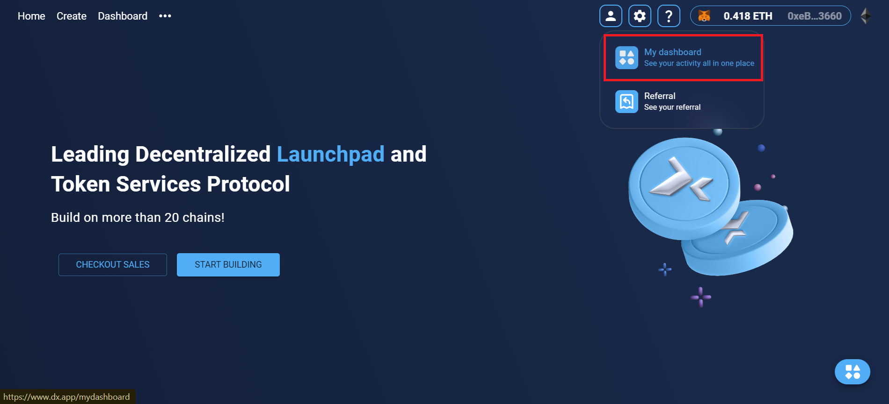
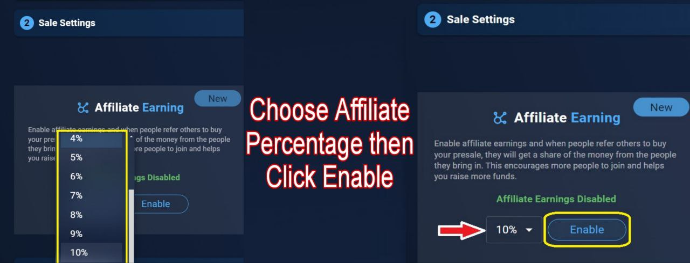
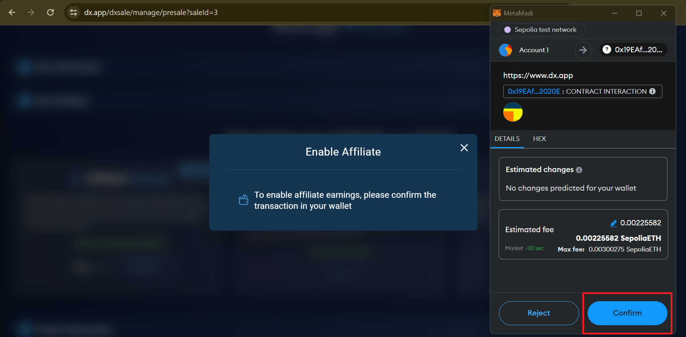
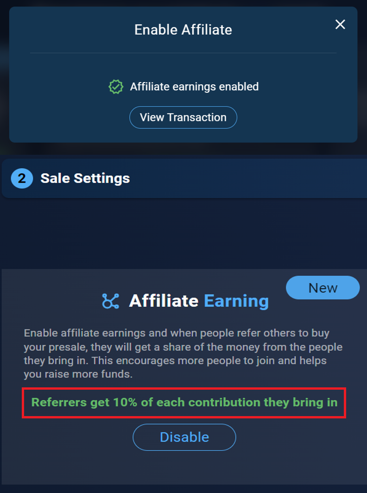
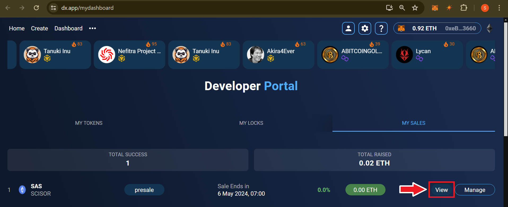
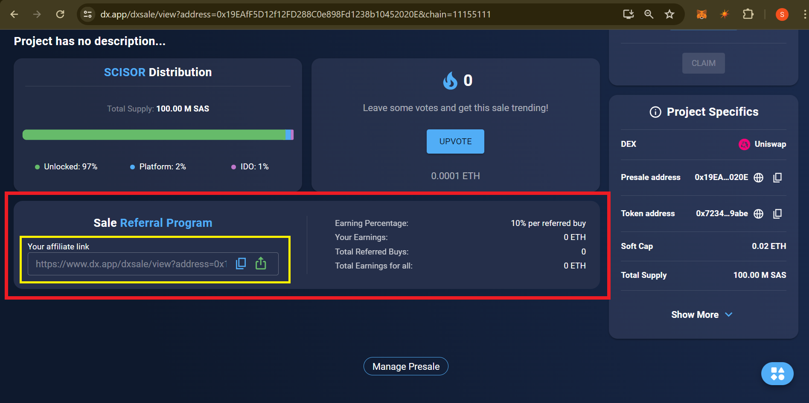

# Affiliate

**Follow below steps to enable Affiliate on your sale.**

Once you create a sale with us you need to go to your sale page to enable Affiliate.&#x20;

You can find your sale from "My dashboard" section.

<figure><figcaption></figcaption></figure>

Select your sale from "_My Sales_" sections and then click on "_Manage_" options.

<figure><figcaption></figcaption></figure>

You can see your "_Affiliate Earning_" options on your "_Manage Presale_" sections under "_Site Settings_" option. For "Affiliate Earning" you need to enable Affiliate Earning feature.

<figure><figcaption></figcaption></figure>

You can set your Affiliate Percentage from minimum 1% to maximum 10%. Select your desired one then click on "_Enable_" option.&#x20;

<figure><figcaption></figcaption></figure>

&#x20;You need to confirm it through a MetaMask transaction.

<figure><figcaption></figcaption></figure>

Your Affiliate option will be enabled instantly and from now Referrers will get commission from each contribution they bring.

<figure><figcaption></figcaption></figure>

**For the Affiliate (Referral) link you need to Click on your view sale page.**

<figure><figcaption></figcaption></figure>

You will get your Affiliate/Referral link in your sale page. Each of your contributors will get unique referral link to refer their friends. They will get instant commission on his wallet for each successful referrals .

<figure><figcaption></figcaption></figure>
