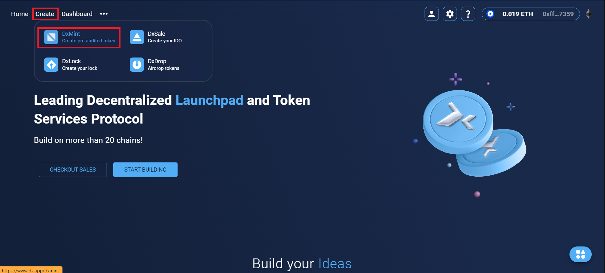

# Fee Token

Fee token is a popular token type that auto yields and generates liquidity collected from anyone who buys and sells the token. This means that every time someone buys and sells a fee token, a fee is collected automatically and dispersed to the holders. A very popular token that utilized fee token model is called Safemoon (estimated all time high market cap of 14 billion usd)

**What is being collected?**

Reflection buy fee, Reflection Sell fee, Liquidity fee and Developer fee.

Reflection buy and sell fee are being collected to buy the tokens and redistributed to all the holders.

Liquidity fee is being collected to put on the liquidity of the token.

Developer fee is being collected by the developer team (in this case yourself) to do what ever you would like to do with that fee.

<figure><figcaption></figcaption></figure>

**How to make Fee token?**

Visit [dx.app](https://www.dx.app/) and click on 'Create', then select 'DxMint'.

<figure><figcaption></figcaption></figure>

Choose your network/chain carefully.

<figure><figcaption></figcaption></figure>

Select 'Fee Token' as the token type. After selecting you will see all the features of Fee Token.

<figure><figcaption></figcaption></figure>

Enter the token information (Token Name, Token Symbol, Token Decimal, Token Total Supply).

<figure><figcaption></figcaption></figure>

After that, you need to enter fee details (Reflection Buy Fee, Reflection Sell Fee, Liquidity Fee, Sell Liquidity Fee). Following that, you need to enter the dev fee and the address that will receive all the fees.

<figure><figcaption></figcaption></figure>

After that, select your targeted DEX and click on 'MINT FEE TOKEN'.

<figure><figcaption></figcaption></figure>

After clicking on 'MINT FEE TOKEN', please confirm the transaction. Once approved, your tokens will be minted and received in your wallet. Remember, there is a minting fee of 1% of the minted tokens.

<figure><figcaption></figcaption></figure>

Below that, you will see all of your minted tokens with DxSale.

<figure><figcaption></figcaption></figure>
