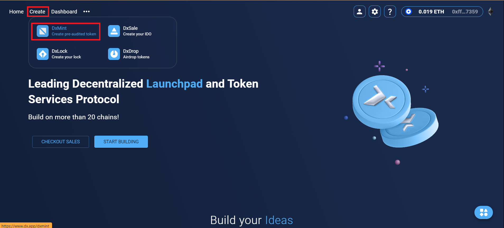

# Standard Token


You must include all info except referral code before minting standard token


Visit [dx.app](https://www.dx.app/) and click on 'Create', then select 'DxMint'.

<figure><figcaption></figcaption></figure>

Choose your network/chain carefully.

<figure><figcaption></figcaption></figure>

Select 'Standard Token' as the token type.

<figure><figcaption></figcaption></figure>

Enter the token information (Token Name, Token Symbol, Token Decimal, Token Total Supply). After entering, click on 'MINT STANDARD TOKEN'.

<figure><figcaption></figcaption></figure>

After clicking on 'MINT STANDARD TOKEN', please confirm the transaction. Once approved, your tokens will be minted and received in your wallet. Remember, there is a minting fee of 1% of the minted tokens.

<figure><figcaption></figcaption></figure>

Below that, you will see all of your minted tokens with DxSale.

<figure><figcaption></figcaption></figure>
