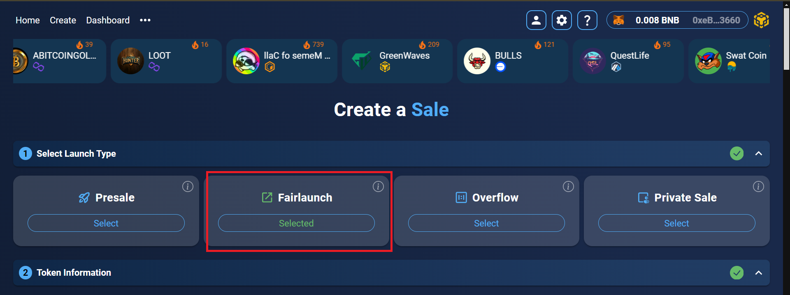
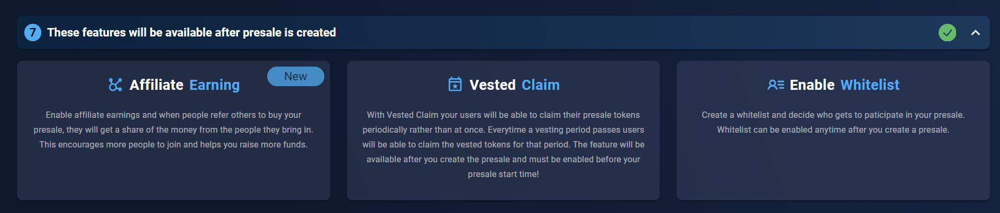

# FairLaunch Tutorial

Fairlaunch is a special type of presale/crowdfunding/ico without any hardcap or maximum amount specified for the raise. Fairlaunch contributors can contribute until the timer of the fairlaunch ends which is specified by the fairlaunch creator. Fairlaunch must raise up to minimum of soft capacity amount for it to be considered successful.

**FairLaunch Flow**

<figure><figcaption></figcaption></figure>


The following are the 7 commandments of DxSale that you must adhere to, to avoid issues and to have a smooth launch

* I understand the functions of my contract.
* I disabled all special transfer functions in my contract.
* I disabled all fees or anything similar while I do my presale.
* I have set Max Transaction Per Wallet to 100% of my supply.
* I did NOT renounce ownership of my contract.
* I am aware of what Liquidity is.
* I did NOT add Tokens to the DEX already.


Once you have understood the Fairlaunch flow, please move onto the Token Info section to start creating your very own Fairlaunch!

**Creating the FairLaunch steps**

<figure><figcaption></figcaption></figure>

Once you click Create your IDO, you will be greeted with the following steps and then select Fairlaunch.

<figure><figcaption></figcaption></figure>

**Token Info**

Copy paste your token address into the second section or you can import your DxMinted token.

<figure><figcaption></figcaption></figure>

**Fairlaunch Information**

Once you get to Create your **Fairlaunch**, you are welcomed by couple of forms as shown below. Do not worry, we explain each of the items right below the screenshot.

<figure><figcaption></figcaption></figure>

**Start with a Template**

This is an automatic Fairlaunch information fill up system by our dapp. You can set your information here as per your soft cap. You need to click on Low cap Gem/Mid raise/Long term raise.

**Or Create Your Own**

**Fairlaunch Rate**

fairlaunch/Presale rate is the rate at which users get your token when they pay with native token during presale/crowdfunding/Initial Coin Offering/ Initial Dex offering


Presale/Fairlaunch Rate must be equal or more than the listing rate


<figure><figcaption></figcaption></figure>

&#x20;

&#x20;

**Listing Rate**

Listing Rate is the rate at which users get your token when they purchase at the DEX. This listing rate only applies when the fairlaunch ends and the token and funds get added to the liquidity pool of the Dex (DxSale creates an exchange pair for you automatically - no coding or manually adding required!).


Once the funds are added, the market supply/demand for your token determines the price at which users can buy/sell at the DEX. If your token is bought heavily after listing - the price of the token will go up. This means that you will get less tokens for the same amount of native token. If the token is heavily sold after listing, the price of the token will go down. This means that you will get more tokens for the same amount of native token.&#x20;



Listing Rate should be equal or less than the fairlaunch rate


<figure><figcaption></figcaption></figure>

&#x20;

**Soft Cap**

Soft cap / Soft capacity means the minimum amount of tokens that you will need to raise in order to consider the crowdsale/presale a success. Raising less than soft cap means you have failed the fairlaunch raise and the funds will automatically be back to the fairlaunch contributors and the custom token will be back to the fairlaunch creator.


There is no hard cap feature in a fairlaunch that means you can raise unlimited.


&#x20;

**Minimum and Maximum Contribution amount**

Minimum and maximum contribution amount is the range at which a buyer can fund your token during fairlaunch/presale. If the contribution is too high, the UI will automatically block the buyer. If the contribution is too low, the UI will automatically block the buyer.


This is a good tool to stop any bulk buyers who can easily dump tokens at exchange post presale/fairlaunch&#x20;


<figure><figcaption></figcaption></figure>


Minimum contribution cannot be 0, Maximum contribution cannot be lower than minimum and higher than Hardcap


**Liquidity and DEX**

This is the percentage of collected funds which gets send to the DEX on completion. The DEX section is where the liquidity will be added.

<figure><figcaption></figcaption></figure>

&#x20;**Token Distribution**

In Token Distribution section you will see a diagram in percentage format! It will show how much tokens for fairlaunch, how much tokens for Liquidity, how much tokens for Platform and how much tokens will be unlocked and burned!

<figure><figcaption></figcaption></figure>

**Fairlaunch Timings & Liquidity Unlock Time**

Fairlaunch Timing is an important step in the fairlaunch creation process. You must choose the timings carefully to ensure that your fairlaunch is going smoothly and also to give you ample timing to enable features that you want to enable or to create hype for your crowd funding. Liquidity Unlock Time must be minimum of 1 month from fairlaunch end time. This ensures that the liquidity pool token which acts like a “key” to the liquidity pool is safely locked. This makes it harder for bad players to pull liquidity from Dex and also ensures extra safety measures to your community.

<figure><figcaption></figcaption></figure>

**Project Information steps**

\
The project information step page looks like this where you can easily upload your Logo, Banner , Website, social links (youtube, github, X(twitter), discord, reddit etc.) as well as project description.


It is highly recommended that you fill out all of these to give your fairlaunch contributors and community every possible information about your project


<figure><figcaption></figcaption></figure>

To fill out the logo and banner, you need to click on Browse and upload an image with .png, .jpg, or .gif from your Device.

Once you upload your image you need to add social links of your projects such as: Website, X(Twitter), Telegram. After submitting logos and socials its time to add a good description for your project. For reference you can see your fairlaunch Card Preview options at the right side of your project information section.

**More Features section**

This section is not enabled during this stage of fairlaunch creation and only available after you have created the fairlaunch  listing.

<figure><figcaption></figcaption></figure>

**Affiliate Earning**

Empower your project with our affiliate program! Activate it after setting up creating your fairlaunch pool. Participants reap the benefits after the fairlaunch wraps up. Don't miss out on maximizing your project's potential.

<figure><figcaption></figcaption></figure>

**Vested Claim**

This feature must be enabled before Finalizing a fairlaunch after it’s successful! If you would like to use this feature, ensure you use this before clicking Finalize on your fairlaunch!

<figure><figcaption></figcaption></figure>

Vested Claim means limiting your fairlaunch buyers / contributors from getting the tokens they have bought during fairlaunch all at once. You can customize the amount of tokens they can get and when. This can be used to prevent instant dumping that can happen when your token has made it to the DEX. This feature is accessible after the fairlaunch has already been listed.

**Enabling Whitelist**

It is highly recommended to enable this and use this feature before fairlaunch starts!

<figure><figcaption></figcaption></figure>

Enabling whitelist gives you the ability to sell your tokens at fairlaunch to a set list of addresses instead of letting all of public to purchase. This is great for KYC control, private sale, or even as a marketing tactic. This feature ensures that certain buyers get priority. This feature can be disabled and re-enabled any time during a live fairlaunch.

**Review and Submit**

Review your fairlaunch and submit by clicking Create Fairlaunch and clicking confirm MetaMask to confirm transaction.

<figure><figcaption></figcaption></figure>

<figure><figcaption></figcaption></figure>

