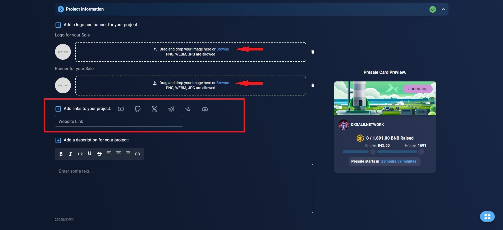

# OverFlow Tutorial

OverFlow is a special type of presale/crowdfunding/ico with hard cap or maximum amount specified, however if the amount raised goes above hardcap, the tokens are then distributed equally and the remaining is refunded back. This type of presale causes a lot of buy pressure post launch.

<figure><figcaption></figcaption></figure>


The following are the 7 commandments of DxSale that you must adhere to, to avoid issues and to have a smooth launch

* I understand the functions of my contract.
* I disabled all special transfer functions in my contract.
* I disabled all fees or anything similar while I do my presale.
* I have set Max Transaction Per Wallet to 100% of my supply.
* I did NOT renounce ownership of my contract.
* I am aware of what Liquidity is.
* I did NOT add Tokens to the DEX already.


Once you understand how the OverFlow presale works, please proceed to create your own OverFlow!

Please go to dx.app and click on the "Create" button, then click on the "Create Your IDO" button.

<figure><figcaption></figcaption></figure>

In Step one, you need to select the sale type as "Overflow." To do this, below "Overflow," there is a "Select" button; click on that.

<figure><figcaption></figcaption></figure>

### **Token Info**

Copy and paste the token contract address into the field.

<figure><figcaption></figcaption></figure>

### Overflow Information

Once you get to Create your Overfow, you are welcomed by couple of forms as shown below. Do not worry, we explain each of the items right below the screenshot.

<figure><figcaption></figcaption></figure>

#### Start With A Template

This is an automatic Presale Information fill up system by our dapp. You can set your information here as per your hard cap. You need to click on Low cap Gem/Mid raise/Long term raise.

#### **Or Create Your Own**

**Overflow Amount:** The amount of tokens you want to sell in this Overflow.

**Listing Amount:** The amount you want to list on the DEX after the overflow ends.

**Soft Cap**

Soft cap / Soft capacity means the minimum amount of tokens that you will need to raise in order to consider the crowdsale/presale a success. Raising less than soft cap means you have failed the presale raise and the funds will automatically be back to the presale contributors and the custom token will be back to the overflow creator.


Liquidity % going to the DEX must be at least 51%&#x20;


**Minimum and Maximum Contribution amount**

Minimum and maximum contribution amount is the range at which a buyer can fund your token during the overflow. If the contribution is too high, the UI will automatically block the buyer. If the contribution is too low, the UI will automatically block the buyer.


This is a good tool to stop any bulk buyers who can easily dump tokens at exchange post presale&#x20;


<figure><figcaption></figcaption></figure>


Minimum contribution cannot be 0, Maximum contribution cannot be lower than minimum and higher than Hardcap ( But there is no hardcap in the overflow)


**Liquidity and DEX**

This is the percentage of collected funds which gets send to the DEX on completion. The DEX section is where the liquidity will be added.

The liquidity must be more than 51%.

<figure><figcaption></figcaption></figure>

**Token Distribution**

In Token Distribution section you will see a diagram in percentage format! It will show how much tokens for Presale, how much tokens for Liquidity, how much tokens for Platform and how much tokens will be unlocked and burned!

<figure><figcaption></figcaption></figure>

**Overflow Timings & Liquidity Unlock Time**

Overflow Timing is an important step in the presale creation process. You must choose the timings carefully to ensure that your overflow creation is going smoothly and also to give you sample timing to enable features that you want to enable or to create hype for your crowd funding. Liquidity Unlock Time must be minimum of 1 month from overflow end time. This ensures that the liquidity pool token which acts like a “key” to the liquidity pool is safely locked. This makes it harder for bad players to pull liquidity from Dex and also ensures extra safety measures to your community.

<figure><figcaption></figcaption></figure>

**Project Information steps**

The project information step page looks like this where you can easily upload your Logo, Banner , Website, social links (youtube, github, X(twitter), discord, reddit etc.) as well as project description.

<figure><figcaption></figcaption></figure>


It is highly recommended that you fill out all of these to give your presale contributors and community every possible information about your project


To fill out the logo and banner, you need to click on Browse and upload an image with .png, .jpg, or .gif from your Device.

Once you upload your image you need to add social links of your projects such as: Website, X(Twitter), Telegram. After submitting logos and socials its time to add a good description for your project. For reference you can see your Presale Card Preview options at the right side of your project information section.

**More Features section**

This section is not enabled during this stage of presale creation and only available after you have created the presale listing.

<figure><figcaption></figcaption></figure>

**Affiliate Earning**

Empower your project with our affiliate program! Activate it after setting up creating your presale pool. Participants reap the benefits after the presale wraps up. Don't miss out on maximizing your project's potential.

Affiliate pays out referrers in native token.

But the project has to deposit extra tokens for another reason.

Let's say the hardcap is 10 BNB and your affiliate earning is 10%, 100 tokens are for presale.

I buy 10 BNB, you get 1 BNB affiliate.

The sale now has 9 BNB raised but I get tokens for 10 BNB (all 100), meaning whoever buys the remaining 1 BNB now needs the extra tokens to be able to also claim.

<figure><figcaption></figcaption></figure>

**Vested Claim**

This feature must be enabled before Finalizing a presale after it’s successful! If you would like to use this feature, ensure you use this before clicking Finalize on your presale!

<figure><figcaption></figcaption></figure>

Vested Claim means limiting your presale buyers / contributors from getting the tokens they have bought during presale all at once. You can customize the amount of tokens they can get and when. This can be used to prevent instant dumping that can happen when your token has made it to the DEX. This feature is accessible after the presale has already been listed.

&#x20;

&#x20;

**Enabling Whitelist**


It is highly recommended to enable this and use this feature before presale starts!


<figure><figcaption></figcaption></figure>

Enabling white list gives you the ability to sell your tokens at presale to a set list of addresses instead of letting all of public to purchase. This is great for KYC control, private sale, or even as a marketing tactic. This feature ensures that certain buyers get priority. This feature can be disabled and re-enabled any time during a live presale.

**Liquidity Unlock Time**

Liquidity Unlock Time must be minimum of 1 month from presale end time. This ensures that the liquidity pool token which acts like a “key” to the liquidity pool is safely locked. This makes it harder for bad players to pull liquidity from Dex and also ensures extra safety measures to your community

&#x20;

**Review and Submit**

Review your presale and submit by clicking Start Presale and clicking confirm metamask to confirm transaction

<figure><figcaption></figcaption></figure>
