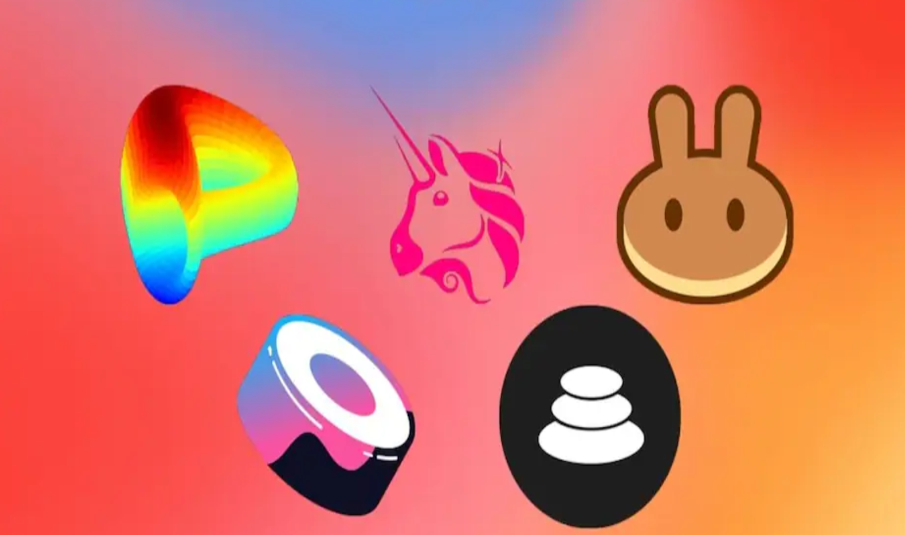
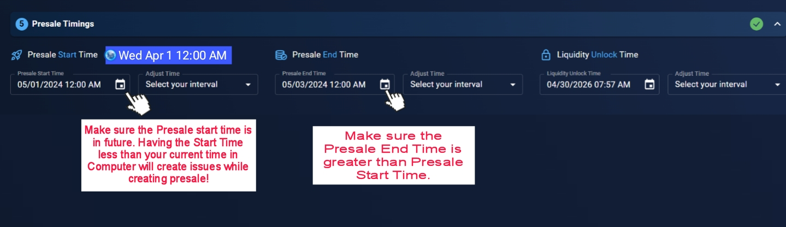

# Standard Presale Tutorial

Presale or standard presale is very simple type of presale, once you list your presale, buyers can buy the token from you at a presale rate of your choice which is then listed on a DEX at a listing rate of your choice.&#x20;


Some of the features such as Vesting, White listing and Affiliate can be enabled and used after presale has been listed


<figure><figcaption></figcaption></figure>


The following are the 7 commandments of DxSale that you must adhere to, to avoid issues and to have a smooth launch

* I understand the functions of my contract.
* I disabled all special transfer functions in my contract.
* I disabled all fees or anything similar while I do my presale.
* I have set Max Transaction Per Wallet to 100% of my supply.
* I did NOT renounce ownership of my contract.
* I am aware of what Liquidity is.
* I did NOT add Tokens to the DEX already.


Once you understand how the presale flow works please see the tutorial steps below:

**Creating the presale steps**

<figure><figcaption></figcaption></figure>

Once you click Create your IDO, you will be greeted with the following steps and then select Presale.

<figure><figcaption></figcaption></figure>

You must complete each steps and forms correctly in order to successfully list the presale. Estimated time is 10 minutes if you are doing everything correctly.

**Token Info**

Copy paste your token address into the second section.

<figure><figcaption></figcaption></figure>

**Presale Information**

Once you get to Create your Presale, you are welcomed by couple of forms as shown below. Do not worry, we explain each of the items right below the screenshot.

<figure><figcaption></figcaption></figure>

**Start with a Template**

This is an automatic Presale Information fill up system by our dapp. You can set your information here as per your hard cap. You need to click on Low cap Gem/Mid raise/Long term raise. &#x20;

**Or Create Your Own**

**Presale Rate**

Presale Rate is the rate at which users get your token when they pay with native token during presale/crowdfunding/Initial Coin Offering/ Initial Dex offering


Presale Rate must be equal or more than the listing rate


<figure><figcaption></figcaption></figure>

&#x20;

**Listing Rate**

Listing Rate is the rate at which users get your token when they purchase at the DEX. This listing rate only applies when the Presale ends and the token and funds get added to the liquidity pool of the Dex ([DxSale](https://dx.app/dxsale?ref=raphaeldx\&chain=BNB) creates an exchange pair for you automatically - no coding or manually adding required!).


Once the funds are added, the market supply/demand for your token determines the price at which users can buy/sell at the DEX. If your token is bought heavily after listing - the price of the token will go up. This means that you will get less tokens for the same amount of native token. If the token is heavily sold after listing, the price of the token will go down. This means that you will get more tokens for the same amount of native token.&#x20;



Listing Rate should be equal or less than the presale rate


<figure><figcaption></figcaption></figure>

&#x20;

**Soft Cap**

Soft cap / Soft capacity means the minimum amount of tokens that you will need to raise in order to consider the crowdsale/presale a success. Raising less than soft cap means you have failed the presale raise and the funds will automatically be back to the presale contributors and the custom token will be back to the presale creator.


Soft cap cannot be less than 51% of hard cap amount


<figure><figcaption></figcaption></figure>

&#x20;

**Hard Cap**

Hard cap / Hard capacity means the maximum amount of tokens that you can raise during the crowdsale/presale.


Hard cap cannot be more than twice the soft cap amount


<figure><figcaption></figcaption></figure>

&#x20;

**Minimum and Maximum Contribution amount**

Minimum and maximum contribution amount is the range at which a buyer can fund your token during crowdsale/presale. If the contribution is too high, the UI will automatically block the buyer. If the contribution is too low, the UI will automatically block the buyer.


This is a good tool to stop any bulk buyers who can easily dump tokens at exchange post presale&#x20;


<figure><figcaption></figcaption></figure>


Minimum contribution cannot be 0, Maximum contribution cannot be lower than minimum and higher than Hardcap


**Liquidity and DEX**

&#x20;This is the percentage of collected funds which gets send to the DEX on completion. The DEX section is where the liquidity will be added.

<figure><figcaption></figcaption></figure>

**Token Distribution**

In Token Distribution section you will see a diagram in percentage format! It will show how much tokens for Presale, how much tokens for Liquidity, how much tokens for Platform and how much tokens will be unlocked and burned!

<figure><figcaption></figcaption></figure>

**Presale Timings & Liquidity Unlock Time**

Presale Timing is an important step in the presale creation process. You must choose the timings carefully to ensure that your presale creation is going smoothly and also to give you ample timing to enable features that you want to enable or to create hype for your crowd funding. Liquidity Unlock Time must be minimum of 1 month from presale end time. This ensures that the liquidity pool token which acts like a “key” to the liquidity pool is safely locked. This makes it harder for bad players to pull liquidity from Dex and also ensures extra safety measures to your community.

<figure><figcaption></figcaption></figure>

**Project Information steps**

The project information step page looks like this where you can easily upload your Logo, Banner , Website, social links (youtube, github, X(twitter), discord, reddit etc.) as well as project description.


It is highly recommended that you fill out all of these to give your presale contributors and community every possible information about your project


<figure><figcaption></figcaption></figure>

To fill out the logo and banner, you need to click on Browse and upload an image with .png, .jpg, or .gif from your Device.&#x20;

Once you upload your image you need to add social links of your projects such as: Website, X(Twitter), Telegram. After submitting logos and socials its time to add a good description for your project. For reference you can see your Presale Card Preview options at the right side of your project information section.

**More Features section**

This section is not enabled during this stage of presale creation and only available after you have created the presale listing.

<figure><figcaption></figcaption></figure>

**Affiliate Earning**

Empower your project with our affiliate program! Activate it after setting up creating your presale pool. Participants reap the benefits after the presale wraps up. Don't miss out on maximizing your project's potential.

<figure><figcaption></figcaption></figure>

&#x20;

**Vested Claim**

This feature must be enabled before Finalizing a presale after it’s successful! If you would like to use this feature, ensure you use this before clicking Finalize on your presale!

<figure><figcaption></figcaption></figure>

Vested Claim means limiting your presale buyers / contributors from getting the tokens they have bought during presale all at once. You can customize the amount of tokens they can get and when. This can be used to prevent instant dumping that can happen when your token has made it to the DEX. This feature is accessible after the presale has already been listed.

&#x20;

&#x20;

**Enabling Whitelist**


It is highly recommended to enable this and use this feature before presale starts!


<figure><figcaption></figcaption></figure>

Enabling white list gives you the ability to sell your tokens at presale to a set list of addresses instead of letting all of public to purchase. This is great for KYC control, private sale, or even as a marketing tactic. This feature ensures that certain buyers get priority. This feature can be disabled and re-enabled any time during a live presale.

**Review and Submit**

Review your presale and submit by clicking Start Presale and clicking confirm MetaMask to confirm transaction.

<figure><figcaption></figcaption></figure>

<figure><figcaption></figcaption></figure>
